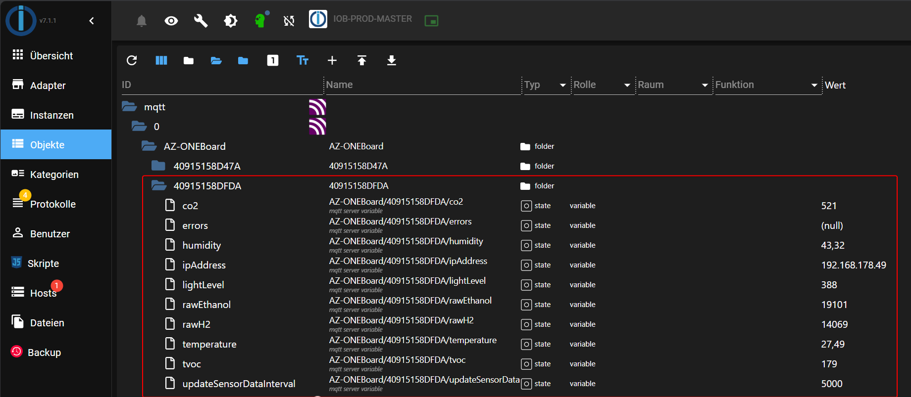
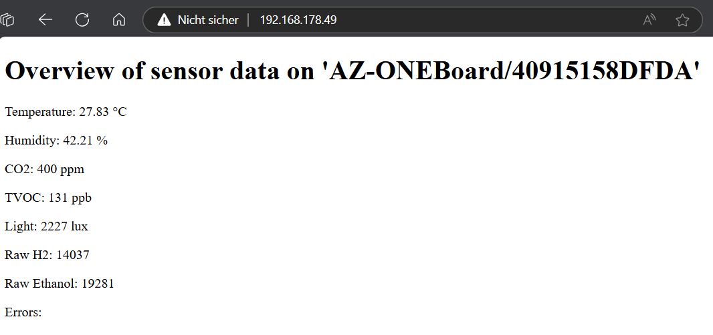

# 🚧 This documentation is still under construction! 🚧

# AZONEBoard

AZONEBoard is a private project for the AZ-ONEBoard from AZ-Delivery. This board includes three environmental sensors and can measure the following values:
- Temperature
- Humidity
- Ambient light
- Ambient gases

Link: [AZ-ONEBoard Product Page](https://www.az-delivery.de/products/az-oneboard-modulares-entwicklungsboard-inklusive-extensionboards-sht30-luftfeuchtigkeit-temperatur-bh1750-umgebungslicht-ccs811-umgebungsgase?variant=44593641881867)

## Implementation Paradigm

This project is implemented using the **Object-Oriented Programming (OOP)** paradigm. OOP is a programming paradigm based on the concept of "objects", which can contain data in the form of fields (often known as attributes or properties), and code in the form of procedures (often known as methods).

### Key OOP Concepts in This Project

1. **Classes and Objects**: The project defines several classes, such as `MqttPublisher`, `WebserverPublisher`, and `SerialPublisher`, each encapsulating specific functionalities related to publishing sensor data. Instances of these classes (objects) are created to perform the actual data publishing tasks.

2. **Encapsulation**: Each class encapsulates its data and methods, providing a clear interface for interaction. For example, the `MqttPublisher` class encapsulates the MQTT client setup, connection handling, and data publishing methods.

3. **Inheritance**: Although not explicitly mentioned in the provided excerpt, OOP allows for the creation of new classes based on existing ones, promoting code reuse and the creation of more specific classes from general ones.

4. **Polymorphism**: This concept allows objects of different classes to be treated as objects of a common superclass. It is particularly useful for implementing interfaces and abstract classes, enabling different classes to be used interchangeably.

5. **Abstraction**: The project abstracts the complexities of sensor data publishing by providing high-level classes that handle the details of MQTT, web server, and serial communication.

By using the OOP paradigm, the project achieves modularity, making it easier to manage, extend, and maintain. Each class is responsible for a specific aspect of the project, promoting a clean and organized codebase.

## Getting Started

To get the project up and running, you first need to set up your development environment. Follow these steps:

### Prerequisites

- [PlatformIO](https://platformio.org/)
- [Visual Studio Code](https://code.visualstudio.com/)

### Configuration of `platformio.ini`

The `platformio.ini` file is the main configuration file for PlatformIO projects. It defines the settings and parameters for building, uploading, and debugging your project. Below is a detailed explanation of the configuration options used in the provided `platformio.ini` file.

In this project, there exist four sections in the `platformio.ini` file:

* **[env:esp12e-usb]**: This section configures the environment for the ESP12E board using USB for uploading firmware. It specifies the platform, board, framework, monitor speed, upload protocol, and the required libraries.

* **[env:esp12e-ota]**: This section configures the environment for the ESP12E board using Over-The-Air (OTA) updates. It includes settings for the platform, board, framework, monitor speed, upload protocol, upload port (IP address for OTA), and the required libraries.

* **[env:esp12e-usb-dev]**: This section is similar to the `esp12e-usb` section but is intended for development purposes. It includes an additional build flag (`-DUSE_PRIVATE_SECRET`) for development-specific configurations.

* **[env:esp12e-ota-dev]**: This section is similar to the `esp12e-ota` section but is intended for development purposes. It also includes the additional build flag (`-DUSE_PRIVATE_SECRET`) and specifies the upload port for OTA updates.

Each section allows for different configurations and settings, enabling you to easily switch between USB and OTA uploads, as well as between production and development environments.

### Features

In this project, three publisher classes have been implemented to publish sensor data in various ways: via MQTT, a serial interface, and a web server.

### MqttPublisher

The `MqttPublisher` class publishes sensor data using the MQTT protocol. It connects to an MQTT broker and sends the sensor data to predefined topics. The class provides the following main functions:

- **Setup**: Initializes the MQTT client and sets the connection parameters.
- **Callback**: Processes incoming MQTT messages and updates the `updateSensorDataInterval` variable.
- **Publish**: Publishes sensor data to various MQTT topics.
- **Reconnect**: Re-establishes the connection to the MQTT broker if it is lost.
- **RegisterCallback**: Registers a callback function to update the sensor data interval.

You can configure, for example, ioBroker to read values via MQTT.

### WebserverPublisher

The `WebserverPublisher` class provides a web server that displays the sensor data on an HTML page. The main functions include:

- **Setup**: Initializes the web server and sets the device name.
- **Handle**: Processes incoming HTTP requests.
- **Publish**: Updates the HTML page with the latest sensor data.
- **HandleRoot**: Generates the HTML page with the sensor data and sends it to the client.

This image shows the web server interface displaying sensor data. The webpage will be updated automatically when new sensor values are available.

### SerialPublisher

The `SerialPublisher` class publishes sensor data via the serial interface. You can use it, for example, during debugging. The main functions include:

- **Setup**: Initializes the serial interface.
- **Publish**: Sends the sensor data over the serial interface to the connected computer or another serial device.

These publisher classes enable the project to flexibly publish and process sensor data through various communication channels.