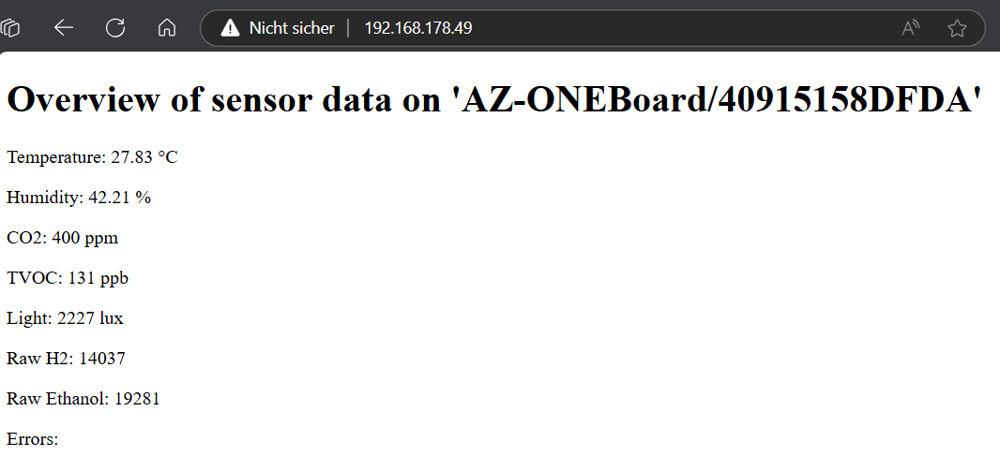
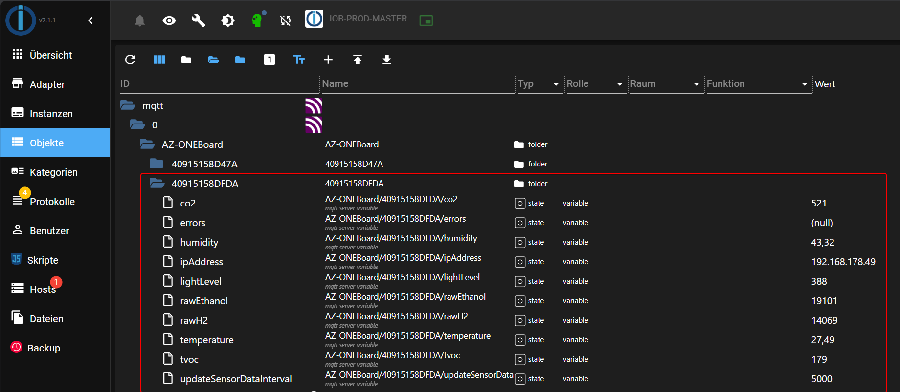
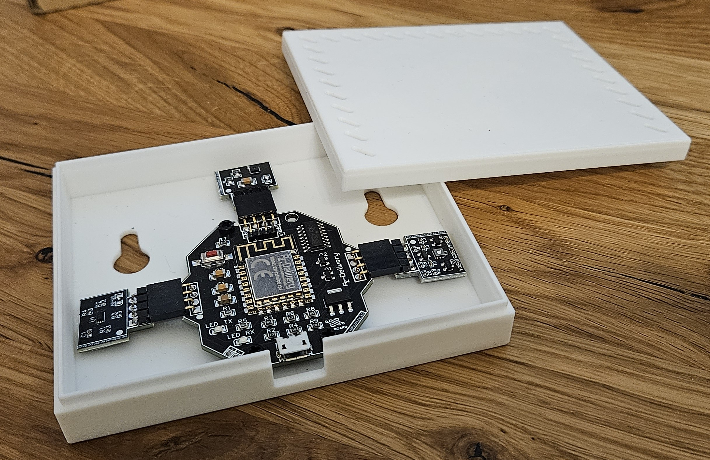
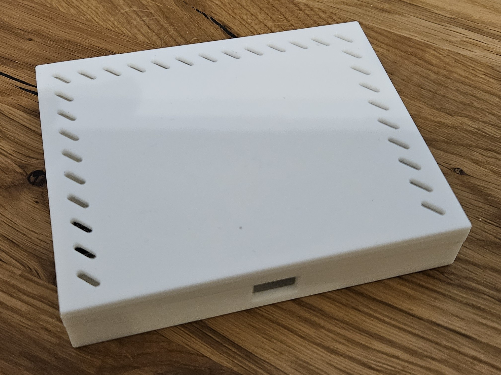

## Table of Contents

1. [Introduction](#introduction)
2. [Architecture](#architecture)
3. [Getting Started](#getting-started)
4. [Build and Upload](#build-and-upload)
5. [Logging](#logging)
6. [Tests and CI](#tests-and-ci)
7. [Publishers](#publishers)
    - [SerialPublisher](#serialpublisher)
    - [WebserverPublisher](#webserverpublisher)
    - [MqttPublisher](#mqttpublisher)
8. [3D-printed Case for the AZ-ONEBoard](#3d-printed-case-for-the-az-oneboard)

---

# Introduction

AZONEBoard is a private project for the AZ-ONEBoard from AZ-Delivery. This board includes three environmental sensors and can measure the following values:
- Temperature
- Humidity
- Ambient light
- Ambient gases

Link: [AZ-ONEBoard Product Page](https://www.az-delivery.de/products/az-oneboard-modulares-entwicklungsboard-inklusive-extensionboards-sht30-luftfeuchtigkeit-temperatur-bh1750-umgebungslicht-ccs811-umgebungsgase?variant=44593641881867)

This project is implemented using the **Object-Oriented Programming (OOP)** paradigm. The project defines several classes, such as `MqttPublisher`, `WebserverPublisher`, and `SerialPublisher`, each encapsulating specific functionality related to publishing sensor data, plus infrastructure classes (`WifiManager`, `OtaManager`, `EepromManager`, `Trace`) that handle connectivity, over-the-air updates, persistence and logging. `Bootstrap` (the composition root) wires all of these together and hands a ready-to-run `Application` to `main.cpp`.

# Architecture

The `src/` layout follows a layered structure:

```text
src/
├── app/            Bootstrap (composition root), Application (startup/loop
│                   orchestration), main.cpp
├── config/         config.h (compile-time constants), systemconfig.h
│                   (injectable runtime config), global_defines.h
├── contracts/      narrow interfaces (IWifiConnectivity, IOtaLoopControl)
├── domain/         pure, hardware-free logic (ReconnectPolicy,
│                   IntervalPolicy) - unit-tested natively, see Tests and CI
├── infrastructure/ WifiManager, OtaManager, Trace (logging)
├── _infra/         EepromManager (persisted settings)
├── _interfaces/    IPublisher, delegates
├── _structures/    SensorData, CommonData, TopicValuePair
├── Sensors/        SensorManager (SHT30/SGP30/BH1750)
└── Publishers/     SerialPublisher, MqttPublisher, WebserverPublisher
    (each implements IPublisher)
```

`WifiManager` connects non-blockingly and reconnects with exponential
backoff + jitter on connection loss; `OtaManager` is fail-closed by default
(OTA stays disabled until a password is configured, see below);
`EepromManager` persists the sensor update interval, which can also be
changed at runtime over MQTT. See `docs/TEMPLATE_MIGRATION_PLAN.md` for the
background on why the project is structured this way.

# Getting Started

## Prerequisites

- [PlatformIO](https://platformio.org/)
- [Visual Studio Code](https://code.visualstudio.com/)

## Secrets and configuration

WiFi/MQTT/OTA credentials and the MQTT broker address are never committed
to this repository - they live one directory above the repo root and are
pulled in via `-I` build flags in `platformio.ini`. Generate the stub
files once:

Windows (PowerShell):
```powershell
.\scripts\setup_secrets.ps1
```

Linux / macOS / CI:
```bash
bash scripts/setup_secrets.sh
```

This creates (only if missing - existing files are never overwritten):

```text
../_secrets/
├── WifiSecret.h     # const char *ssid / *password
├── MqttSecret.h     # const char *mqtt_user / *mqtt_password
└── OtaSecret.h      # const char *ota_password (empty = OTA disabled)
../_config/
└── MqttConfig.h     # const char *mqtt_server / const int mqtt_port
```

Fill in the `TODO` placeholders before building. Leaving `ota_password`
empty is intentional: `OtaManager` is fail-closed and keeps OTA disabled
until a password is set (or `OTA_ALLOW_INSECURE_NO_PASSWORD` is explicitly
enabled in `src/config/config.h` for isolated dev networks only).

## Configuration of `platformio.ini`

Two environments exist:

* **`[env:esp12e-usb]`** - build/upload over USB via `esptool`.
* **`[env:esp12e-ota]`** - build/upload over the air via `espota`. There is
  no fixed device IP in `platformio.ini`; pass it via CLI or use
  `scripts/upload_ota.ps1` (see below).

Both pull in `src/config`, `src/infrastructure`, `src/domain`,
`src/contracts`, `../_secrets` and `../_config` as include paths. A third,
host-only environment, `[env:native]`, builds and runs the unit tests in
`test/native/` (see [Tests and CI](#tests-and-ci)).

# Build and Upload

## USB

```bash
pio run -e esp12e-usb
pio run -e esp12e-usb -t upload -t monitor --upload-port COM3
```

## OTA

After the first USB flash, the board's IP address is printed on the
serial monitor (also visible in your router's DHCP client list, since
`WifiManager` sets a `AZ-ONEBoard/<MAC>` hostname). Upload with:

```powershell
.\scripts\upload_ota.ps1
```

The script prompts for the IP address (remembering the last one used in
`../_secrets/last_ota_ip.txt`) and reads the OTA password from
`../_secrets/OtaSecret.h` automatically. Alternatively:

```bash
pio run -e esp12e-ota --upload-port 192.168.x.x -t upload
```

# Logging

All components log through `Trace` (see `src/infrastructure/trace.h`)
instead of calling `Serial.print` directly:

```cpp
Trace::log(TraceLevel::INFO, "WiFi connected");
Trace::logf(TraceLevel::WARNING, "RSSI: %d dBm", WiFi.RSSI());
```

The minimum level is controlled by `TRACE_LEVEL` in `src/config/config.h`.
Note: `SerialPublisher::publish()` still writes sensor readings directly
to `Serial` - that is its actual published payload, not a log message.

# Tests and CI

- Firmware build: `pio run -e esp12e-usb` / `pio run -e esp12e-ota`
- Native unit tests (no hardware needed): `pio test -e native` - covers
  `src/domain/reconnectpolicy.h` (WiFi reconnect backoff/jitter) and
  `src/domain/intervalpolicy.h` (EEPROM interval bounds check)
- CI workflow: `.github/workflows/c-cpp.yml`, split into a
  `firmware-build` job (creates stub secrets, then builds both
  environments) and a `native-tests` job.

## Publishers

In this project, three publisher classes have been implemented to publish sensor data in various ways: a serial interface, web server or MQTT. Each publisher class encapsulates the functionality required to publish sensor data through a specific communication channel. The main functions of each publisher class are described below.

### SerialPublisher

The `SerialPublisher` class publishes sensor data via the serial interface. You can use it, for example, during debugging. The main functions include:

- **Setup**: Initializes the serial interface.
- **Publish**: Sends the sensor data over the serial interface to the connected computer or another serial device.

These publisher classes enable the project to flexibly publish and process sensor data through various communication channels.

### WebserverPublisher

The `WebserverPublisher` class provides a web server that displays the sensor data on an HTML page. The main functions include:

- **Setup**: Initializes the web server and sets the device name.
- **Handle**: Processes incoming HTTP requests.
- **Publish**: Updates the HTML page with the latest sensor data.
- **HandleRoot**: Generates the HTML page with the sensor data and sends it to the client.

This image shows the web server interface displaying sensor data. The webpage will be updated automatically when new sensor values are available.



### MqttPublisher

The `MqttPublisher` class publishes sensor data using the MQTT protocol. It connects to an MQTT broker and sends the sensor data to predefined topics. The class provides the following main functions:

- **Setup**: Initializes the MQTT client and sets the connection parameters.
- **Callback**: Processes incoming MQTT messages and updates the `updateSensorDataInterval` variable.
- **Publish**: Publishes sensor data to various MQTT topics.
- **Reconnect**: Re-establishes the connection to the MQTT broker if it is lost.
- **RegisterCallback**: Registers a callback function to update the sensor data interval.

You can configure, for example, ioBroker to read values via MQTT.




## 3D-printed Case for the AZ-ONEBoard

I have designed a 3D-printed case for the AZ-ONEBoard. The case consists of two parts: a base and a cover. The base holds the AZ-ONEBoard and provides two openings for the holding screws. The cover fits over the base and has openings for the sensors and the USB port. The STL and f3d files are available in the `case` folder.




